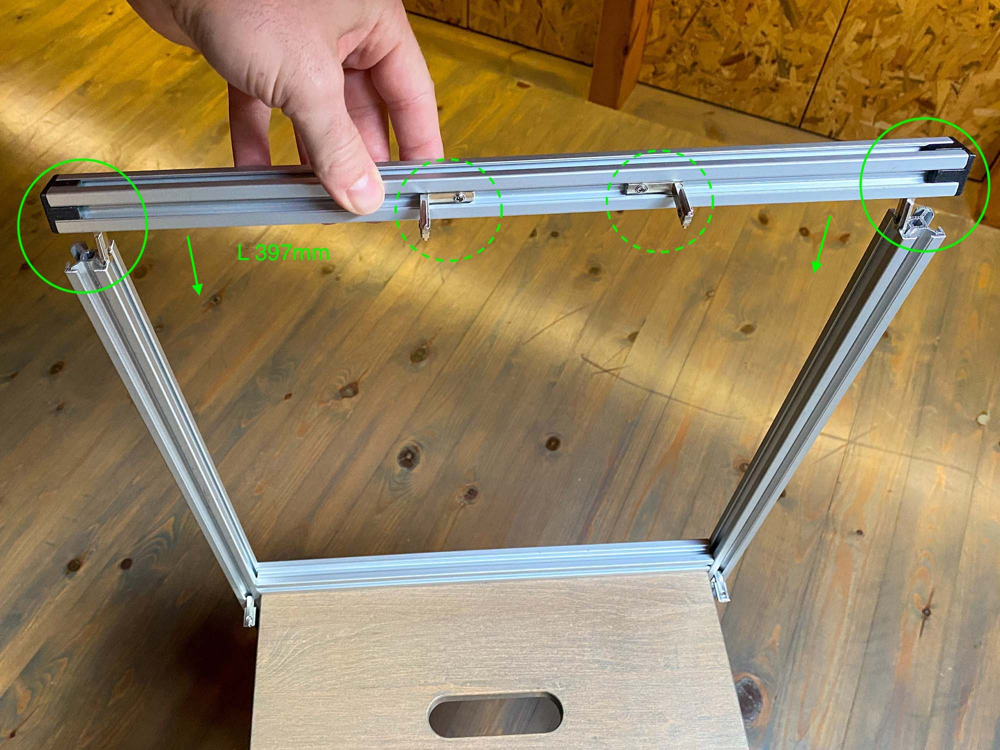

# Learning tower v1
Learning tower for kids made of an IKEA step stool, aluminium extrusions and 3d printing

## BoM
| Name | Quantity | Photo |
|-|-|-|
| [IKEA Bekvaem step stool](https://www.ikea.com/gb/en/p/bekvaem-step-stool-aspen-10225589/) | 1 |  |
| Aluminium extrusion - W20xD20xL**430**mm | 4 |  |
| Aluminium extrusion - W20xD20xL**397**mm | 2 |  |
| Aluminium extrusion - W20xD20xL**363**mm | 1 |  |
| Aluminium extrusion - W20xD20xL**242**mm | 2 |  |
| Aluminium extrusion - W20xD20xL**202**mm | 2 |  |
| [Inside corner connector 2020](https://www.amazon.com/uxcell-Interior-Connector-Aluminum-Extrusion/dp/B07VP59DY5/ref=psdc_16412271_t2_B071LPFZM2) | 16 |  |
| [countersunk wood screw - 5x60cm](https://www.amazon.com/Phillips-Drilling-Stainless-Drywall-Screws/dp/B07M7S6N4V/ref=sr_1_4?crid=2J7ESKXZ3AXOZ&keywords=wood%2Bscrew%2B5x60&qid=1644572210&sprefix=wood%2Bscrew%2B5x6%2Caps%2C168&sr=8-4&th=1) | 4 |  |
| [End Cap - 3D printed](./output/STL/End-Cap.stl) | 4 |  |
| [Adapter F-L - 3D printed](./output/STL/Adapter-F-L.stl) | 1 |  |
| [Adapter B-L - 3D printed](./output/STL/Adapter-B-L.stl) | 1 |  |
| [Adapter F-R - 3D printed](./output/STL/Adapter-F-R.stl) | 1 |  |
| [Adapter B-R - 3D printed](./output/STL/Adapter-B-R.stl) | 1 |  |
| [Assembly Jig - 3D printed](./output/STL/Assembly-Jig.stl) | 1 |  |

## Tools
| Name | Photo |
|-|-|
| Phillips screwdriver |  |
| Allen key 2.5mm |  |
| Allen key 4mm |  |
| Tape measure |  |
| Pensil |  |

## Preparing

### Ordering components

### 3D printing

You need to print (or order [online](https://www.hubs.com/)) the following parts:

- 4x [End Cap](./output/STL/End-Cap.stl)
- 1x [Adapter F-L](./output/STL/Adapter-F-L.stl)
- 1x [Adapter B-L](./output/STL/Adapter-B-L.stl)
- 1x [Adapter F-R](./output/STL/Adapter-F-R.stl)
- 1x [Adapter B-R](./output/STL/Adapter-B-R.stl)
- 1x [Assembly Jig](./output/STL/Assembly-Jig.stl)

Printing settings

- Infill: 70%
- Wall thickness/ Perimeters: 4
- Top and bottom layers: 6
- Material: PLA is ok but you could use more advanced materials like PETG
- Support: Support is not required apart from the Assembly Jig

Notes

- For safety reasons, I cranked the printing values up to make sure I get parts that can withstand stress
- It's a good idea to print a sample Adapter and test how strong it is. The Adapters support the whole structure so not having reliable parts defeats the purpose of the project.

### Smoothing edges

  

### Aluminum extrusions by length (L)

  

## Assembly

#### 1. Assemble the step stool following IKEA's instructions

#### 2. Remove the 4 screws of the step stool that are located near the top

  

#### 3. Use the screws you removed to secure the Adapters in place, make sure the Adapters are installed in the correct location
- Every adapter has a letter combination barking (F for front, B for back, R for right, L for Left)
- Do not fully tighten the screws

  

  

  

  

#### 4. Insert an L 430mm extrusion to one of the Adapters at the back, make sure it is fully inserted

  

#### 5. Insert another L 430mm extrusion to the opposite Adapter at the back, make sure it is fully inserted

  

#### 6. Insert two corner connectors to the extrusions you just installed
- The corner connectors should point towards the front side

  

#### 7. Insert an L 363mm extrusion using two corner connectors
- Push the extrusion all the way towards the adapters but don't tighten it yet

  

#### 8. Insert an End Cap to one end of an L 397mm extrusion and press it all the way in
- You might need to hammer it lightly

  

#### 8. On the other end of the same extrusion, insert 4 corner connector as in the picture below and then insert an End Cap to lock that end
- Pay close attention to the direction and location of each corner connector

  

#### 10. Repeat the previous two steps with the other L 397mm extrusion, this time insert only 2 corner connector as in the picture below

  

#### 11. Insert the L 397mm extrusion with the 4 corner connectors
- Pay close attention to the direction of each corner connector

  

#### 12. Use the Assembly Jig to align the extrusions and tighten the corner connector
- Spend some time to fasten the connector gradually, this will give you a better alignment

  

#### 13. Repeat the previous step for the opposite corner

  

#### 14. Using the tape measure, put a pencil mark at around 20cm from the top extrusion, do this on both sides

  

#### 15. Lift the L 363mm extrusion and align it with the pencil mark, use the Jig to align the extrusions and tighten the corner connector

  

#### 16. Insert the two remaining L 430mm extrusions to the Adapters at the front

  

  

  

  

  

  

  

  

  

  

  

