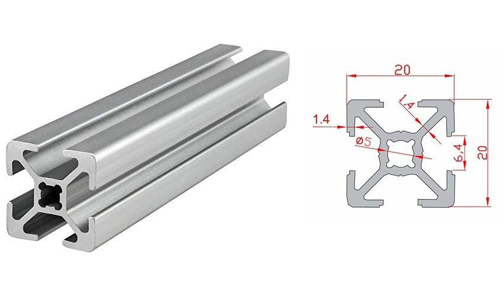

# Learning tower v1
Learning tower for kids made of an IKEA step stool, aluminium extrusions and 3d printing

### BoM
| Name | Quantity | Photo |
|-|-|-|
| [IKEA Bekvaem step stool](https://www.ikea.com/gb/en/p/bekvaem-step-stool-aspen-10225589/) | 1 |  |
| aluminium extrusion - W20xD20xL**430**cm | 4 |  |
| aluminium extrusion - W20xD20xL**397**cm | 2 |  |
| aluminium extrusion - W20xD20xL**363**cm | 1 |  |
| aluminium extrusion - W20xD20xL**242**cm | 2 |  |
| aluminium extrusion - W20xD20xL**202**cm | 2 |  |
| [inside corner connector 2020](https://www.amazon.com/uxcell-Interior-Connector-Aluminum-Extrusion/dp/B07VP59DY5/ref=psdc_16412271_t2_B071LPFZM2) | 16 |  |
| [countersunk wood screw - 5x60cm](https://www.amazon.com/Phillips-Drilling-Stainless-Drywall-Screws/dp/B07M7S6N4V/ref=sr_1_4?crid=2J7ESKXZ3AXOZ&keywords=wood%2Bscrew%2B5x60&qid=1644572210&sprefix=wood%2Bscrew%2B5x6%2Caps%2C168&sr=8-4&th=1) | 4 |  |
| End Cap - 3D printed | 4 |  |
| Adapter F-L - 3D printed | 1 |  |
| Adapter B-L - 3D printed | 1 |  |
| Adapter F-R - 3D printed | 1 |  |
| Adapter B-R - 3D printed | 1 |  |

## 1

### 1.1
