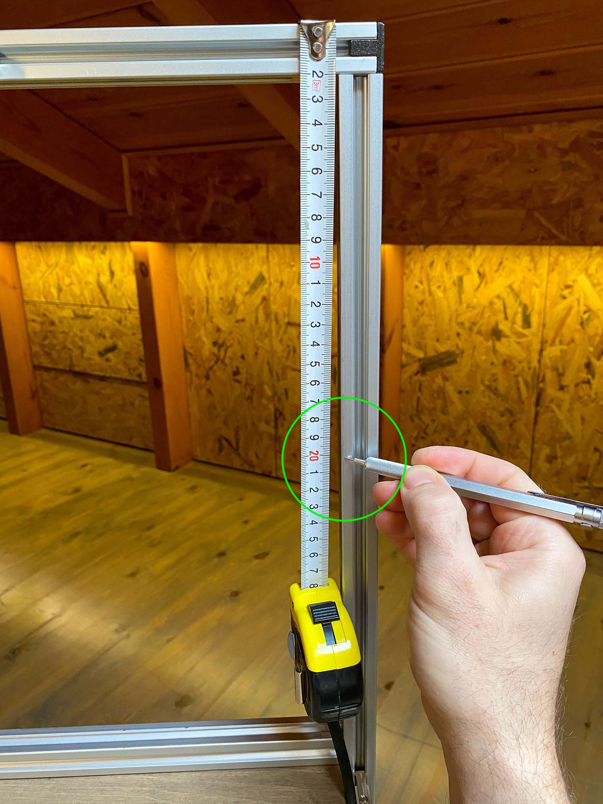
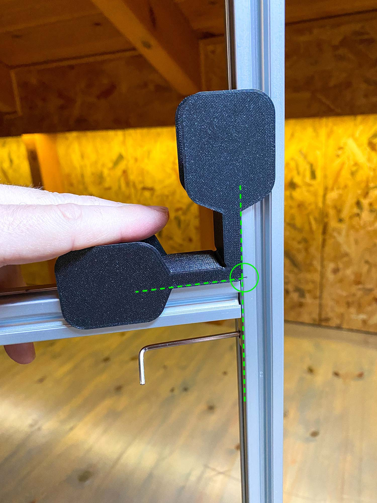
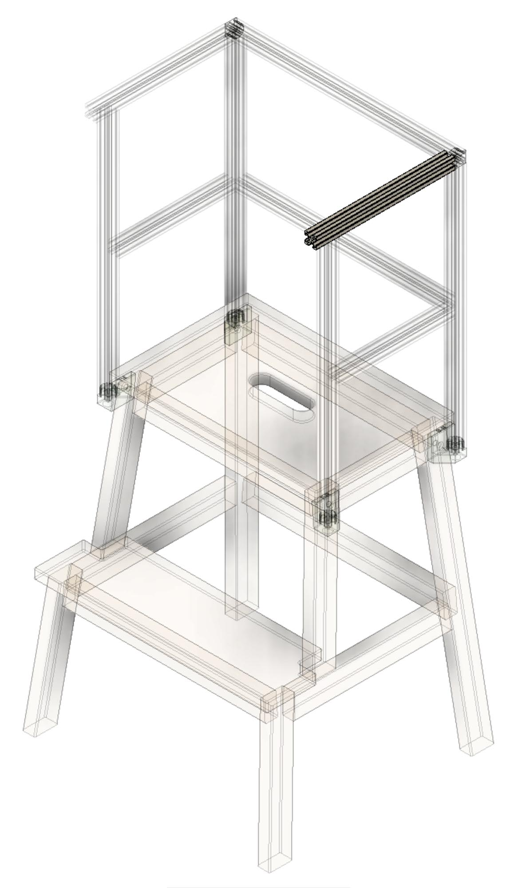

# Learning tower v1
Learning tower for kids made of an IKEA step stool, aluminium extrusions and 3d printing, [online 3D preview](https://balena.autodesk360.com/g/projects/D20190315182303426/data/dXJuOmFkc2sud2lwcHJvZDpmcy5mb2xkZXI6Y28ubmtnMlIwTlFSSks2dXlaU0ZUeFVxUQ/dXJuOmFkc2sud2lwcHJvZDpkbS5saW5lYWdlOlpKQ3FaQXQ2UkZldFU1ZUlsTlBXRlE/viewer?redirectSource=shared).

  

I was looking to buy a learning tower for my little monkey, so he can start playing independently and safely on worktops that are designed for adults. There are many designs available online but they are usually either expensive for what they offer or unattractive (for my taste). I decided to build one on my own and since there is a DIY trend that uses an IKEA step stool for this matter, I followed that path. Initially, I made an extension for the IKEA step stool made out of oak scrap wood. It turned out super nice but I used a series of advanced tools to achieve a professional result. Then, I started thinking how I could put together a simple bill of materials that pretty much anyone could source and assemble without any required cutting or drilling. I considered a few options but aluminium extrusions are too sexy to be ignored. I paired it with 3D printing, mainly for the connections between the step stool and the aluminium structure. My goal is to use the stool's existing holes and screws and make it easy to remove the aluminium structure when it is no longer needed. Arguably, not everyone has a 3D printer but getting access to one is not that difficult and there are many online services available these days.

  

Towards the end, I list some thoughts for a future version. Feel free to add issues on GH for future product improvements or corrections of the current version. I have also included the source files (Fusion 360) in case someone wants to modify the design.

## Preparation

### Ordering components - BoM

I have included an example online source for every part but you might need to do some research and find a relevant suppliers based on your location. Aluminium extrusions are widely spread and there are plenty of online shops that ship the extrusions pre-cut at your desired length. There are many ways to connect the extrusions, I chose the corner connectors because they are cheap, discreet, easy to source and easy to install.

| Name | Quantity | Photo |
|-|-|-|
| [IKEA Bekvaem step stool](https://www.ikea.com/gb/en/p/bekvaem-step-stool-aspen-10225589/) | 1 |  |
| [Aluminium extrusion - 20x20 x L **430** mm](https://www.framingtech.com/20-x-20-20x203m) | 4 |  |
| [Aluminium extrusion - 20x20 x L **397** mm](https://www.framingtech.com/20-x-20-20x203m) | 2 |  |
| [Aluminium extrusion - 20x20 x L **363** mm](https://www.framingtech.com/20-x-20-20x203m) | 1 |  |
| [Aluminium extrusion - 20x20 x L **242** mm](https://www.framingtech.com/20-x-20-20x203m) | 2 |  |
| [Aluminium extrusion - 20x20 x L **202** mm](https://www.framingtech.com/20-x-20-20x203m) | 2 |  |
| [Inside corner connector 2020](https://www.amazon.com/uxcell-Interior-Connector-Aluminum-Extrusion/dp/B07VP59DY5/ref=psdc_16412271_t2_B071LPFZM2) | 14 |  |
| [Countersunk wood screw - 5x60cm (or longer)](https://www.amazon.com/Phillips-Drilling-Stainless-Drywall-Screws/dp/B07M7S6N4V/ref=sr_1_4?crid=2J7ESKXZ3AXOZ&keywords=wood%2Bscrew%2B5x60&qid=1644572210&sprefix=wood%2Bscrew%2B5x6%2Caps%2C168&sr=8-4&th=1) | 4 |  |

### 3D printing

You need to print (or order [online](https://www.hubs.com/)) the following parts:

| Name | Quantity | Photo |
|-|-|-|
| [End Cap - 3D printed](./output/STL/End-Cap.stl) | 4 |  |
| [Adapter F-L - 3D printed](./output/STL/Adapter-F-L.stl) | 1 |  |
| [Adapter B-L - 3D printed](./output/STL/Adapter-B-L.stl) | 1 |  |
| [Adapter F-R - 3D printed](./output/STL/Adapter-F-R.stl) | 1 |  |
| [Adapter B-R - 3D printed](./output/STL/Adapter-B-R.stl) | 1 |  |
| [Assembly Jig - 3D printed](./output/STL/Assembly-Jig.stl) | 1 |  |

Printing settings

- Infill: 70%
- Wall thickness/ Perimeters: 4
- Top and bottom layers: 6
- Material: PLA is ok but you could use more advanced materials like PETG
- Support: Support is not required apart from the Assembly Jig

Notes

- For safety reasons, I cranked the printing values up to make sure I get parts that can withstand stress
- It's a good idea to print a sample Adapter and test how strong it is. The Adapters support the whole structure so not having reliable parts defeats the purpose of the project.

### Smoothing the edges
Aluminium extrusions' edges are usually rough and potentially dangerous so I strongly recommend smoothing all the edges with a file or sandpaper.

  

###  Aluminium extrusions by length (L)
Lay down all the extrusions by length, this will make assembly way easier

  

### Tools
| Name | Photo |
|-|-|
| Phillips screwdriver |  |
| Allen key 2.5mm |  |
| Allen key 4mm |  |
| Tape measure |  |
| Pencil |  |

## Assembly

#### 1. Assemble the step stool following IKEA's instructions

#### 2. Remove the 4 screws of the step stool that are located near the top

  

#### 3. Use the screws you removed to secure the `Adapters` in place, make sure the `Adapters` are installed in the correct location
- Every adapter has a letter combination marking (F for front, B for back, R for right, L for Left)
- Do not fully tighten the screws

  

  

  

  

  

#### 4. Insert an `L 430mm` extrusion to one of the `Adapters` at the back, make sure it is fully inserted

  

  

#### 5. Insert another `L 430mm` extrusion to the opposite `Adapter` at the back, make sure it is fully inserted

  

  

#### 6. Insert two corner connectors to the extrusions you just installed
- The corner connectors should point towards the front side

  

#### 7. Insert an `L 363mm` extrusion using two corner connectors
- Push the extrusion all the way downwards but don't tighten the connector yet

  

  

#### 8. Insert an `End Cap` to one end of an `L 397mm` extrusion and press it all the way in
- You might need to hammer it lightly

  

#### 9. On the other end of the same extrusion, insert 4 corner connector as in the picture below and then insert an `End Cap` to lock that end
- Pay close attention to the direction and location of each corner connectors

  

#### 10. Repeat the previous two steps with the other `L 397mm` extrusion, this time insert only 2 corner connectors as in the picture below

  

#### 11. Insert the `L 397mm` extrusion with the 4 corner connectors
- Pay close attention to the direction of each corner connector

  

  

#### 12. Use the `Assembly Jig` to align the extrusions and tighten the corner connector
- Spend some time to fasten the connector gradually, this will give you a better alignment

  

#### 13. Repeat the previous step for the opposite corner

#### 14. Using the tape measure, put a pencil mark at around 20cm from the top extrusion, do this on both sides

  

#### 15. Lift the `L 363mm` extrusion and align it with the pencil mark, use the `Jig` to align the extrusions and tighten the corner connector

  

  

#### 16. Insert the two remaining `L 430mm` extrusions to the Adapters at the front

  

  

  

#### 17. Insert an `L 202mm` extrusion on one of the stool sides. You need to use the corner connector you inserted earlier on the `L 430mm` extrusion, plus a new one on the other side. Do not tighten the connectors yet.

  

  

#### 18. Repeat the previous step on the opposite side with the remaining `L 202mm` extrusion

  

#### 19. Insert an `L 242mm` extrusion on one of the stool sides. You need to use the corner connector you inserted earlier on the `L 397mm` extrusion, plus a new one on the other side. Do not tighten the connectors yet.
- Pay attention to the orientation of the corner connectors

  

  

#### 20. Repeat the previous step on the opposite side with the remaining `L 242mm` extrusion

  

#### 21. Use the `Assembly Jig` to align the `L 242mm` to the `L 397mm` extrusion and tighten the corner connector

  

#### 22. Using the tape measure, put a pencil mark on the `L 430mm` extrusion at around 20cm from the top of the `L 242mm` extrusion, do this on both sides

  

#### 23. Use the `Assembly Jig` to align the `L 202mm` to the `L 430mm` extrusion and tighten both corner connectors, do this on both sides

  

  

  

#### 24. Now go back and tighten the remaining corner connector of the `L 430mm` and `L 242mm` extrusions, do this on both sides

  

  

#### 25. Insert the last extrusion, `L 397mm` (with 2 corner connectors), to the `L 242mm` extrusions. Tighten both corner connectors.

  

  

#### 26. Insert the 4 wood screws to the bottom of the 4 `Adapters`, so that the screw secures the `L 430mm` extrusions. Do not overtighten these screws.
- **Important note:** using wood screws on extrusions is a bit unusual. The center hole on the extrusion is meant to be tapped so it can accept a standard bolt, something like an M6 in this case. This would however require some more advanced tooling, like an M6 tap (feel free to go down that path if you fancy), so I decided to stick to a screw that is easy to install. A 5mm (diameter) wood screw fits nicely on my extrusion profile, and its length provides enough grip for the threads. However, the diameter of the extrusion's center hole varies slightly from manufacturer to manufacturer, so I highly recommend testing the screws before assembly and making an effort to find a screw that fastens securely.

  

#### 27. Tighten the 4 screws that secure the `Adapters` to the step stool

  

#### 28. Enjoy your build!

  

# Future improvements

- I don't love that the 4 adapters differ slightly in dimensions to match the stool's holes accordingly. I'd prefer one simpler adapter design that fits all 4 corners but this requires some experimentation.
- The adapters have a tight fit with the extrusion's T-slot internal profile. This could potentially vary from profile to profile which could render the adapter unusable.
- The rails of the extrusions occasionally trap food and dirt and they are not super easy to clean. There are some profiles that have one or two sides plain (no rail) which might be a decent solution.
- Because of the extrusions, it's easy to convert the aluminium structure to something else when it's no longer needed (like a chair or a table or something) but I haven't explored that aspect yet.
